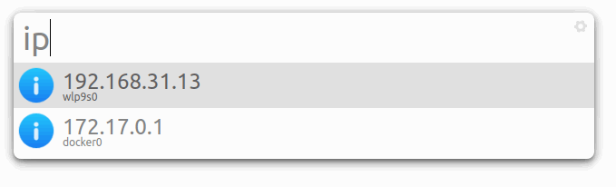

# IP Plugin for albert

A [albert launcher] plugin for displaying local IP address information.

[albert launcher]: https://github.com/albertlauncher/albert




## How to use

### 📋 Prerequisite

Install dependencies of [albert launcher]:

``` bash
# basic dependencies:
sudo apt-get install -y cmake g++

# albert's dependencies:
sudo apt-get install --no-install-recommends -y libmuparser-dev python3-dev \
	libqalculate-dev libqt5svg5-dev libqt5x11extras5-dev qtbase5-dev qtdeclarative5-dev

# this plugin's dependencies:
sudo apt-get install -y libqt5network5
```

**NOTICE:** 

1. Check the docker file in [albert launcher] git repository for an up to date list of dependencies.
2. Make sure your Qt version is greater or equals than **5.11.0**
	- Because this plugin use the function `isBroadcast` which added since Qt 5.11.0


### ⚙️ Building

``` bash
# 1. clone `albert` repo and this repo to local:
git clone https://github.com/albertlauncher/albert.git --recursive
git clone https://github.com/hangxingliu/albert-plugin-ip.git

# 2. mount this plugin into building step of albert
cd albert-plugin-ip
./mount-plugin.sh ../albert

# 3. build and install albert
cd ../albert
mkdir build;
cmake .. -DCMAKE_INSTALL_PREFIX=/usr -DCMAKE_BUILD_TYPE=Debug;
make
sudo make install;
# albert will be installed into:
#   /usr/bin/albert
#   /usr/lib/x86_64-linux-gnu/albert/plugins/lib****.so

# 4. umount this plugin from building step of albert
#     for keeping clean of albert source code
cd ../albert-plugin-ip
./umount-plugin.sh ../albert
```

**NOTICE:** 

Get reference from following links if you met problem in `cmake` or `make` command:

- <https://albertlauncher.github.io/docs/installing/>
- [My building recipe](docs/MY-BUILDING-RECIPE.md)


### 🧸 Enjoy it

Open albert launcher, and query ip by command looks like `ip`, `ipv4` or `ipv6`.

## Modify by yourself

Get reference from [My building recipe](docs/MY-BUILDING-RECIPE.md)

## Author

[Liu Yue (@hangxingliu)](https://github.com/hangxingliu)

## License

[GPL-3.0](LICENSE)
